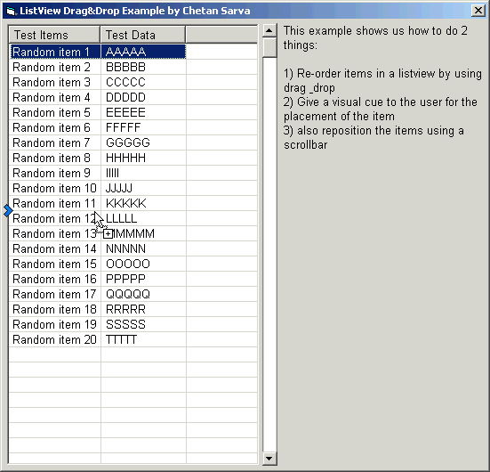



## Drag & Drop Re\-ordering of ListView Items

### Description

Shows how to re-order items in a listview by dragging and dropping them in their new position. Also shows how to give the user a nice visual cue for the new position. Items can also be re-ordered using the scrollbar.
 
### More Info
 
The visual cue does some weird things when scrolling the listview while dragging an item.

             |
---                |---
**Submitted On**   |2001-07-13 22:14:02
**By**             |[Chetan Sarva](https://github.com/Planet-Source-Code/PSCIndex/blob/master/ByAuthor/chetan-sarva.md)
**Level**          |Intermediate
**User Rating**    |4.8 (58 globes from 12 users)
**Compatibility**  |VB 6\.0
**Category**       |[Custom Controls/ Forms/  Menus](https://github.com/Planet-Source-Code/PSCIndex/blob/master/ByCategory/custom-controls-forms-menus__1-4.md)
**World**          |[Visual Basic](https://github.com/Planet-Source-Code/PSCIndex/blob/master/ByWorld/visual-basic.md)
**Archive File**   |[Drag & Dro227427132001\.zip](https://github.com/Planet-Source-Code/chetan-sarva-drag-drop-re-ordering-of-listview-items__1-25003/archive/master.zip)

